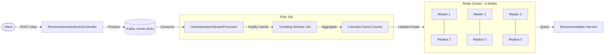

# Recommendation Service API

This project implements a real-time recommendation engine service. It collects user interactions (such as clicking on a film or searching), aggregates these interactions to calculate scores or preferences (e.g., top genres), and prepares this data to recommend new films to the user.

## Features

- **Real-time Data Processing**: Uses Apache Flink to process user interaction streams in real-time.
- **User Interaction Tracking**: Captures events like clicks and searches via a REST API.
- **Aggregation**: Aggregates user data over time windows (e.g., 10 seconds) to determine user preferences (e.g., favorite genre).
- **Kafka Integration**: Consumes interaction events from a Kafka topic (`movie-clicks`).
- **Redis Cluster Storage**: Stores and updates user preference leaderboards (Sorted Sets) in a 6-node Redis Cluster (3 Masters, 3 Replicas) for high availability and low latency.

## How It Works

1. **Ingestion**: 
   - Clients send user interactions (clicks, etc.) to the REST API endpoint `/click`.
   - The `ReceiveInteractionEventController` publishes these events to a Kafka topic (`movie-clicks`).
2. **Processing**: 
   - The `UserInteractionStreamProcessor` (Flink Job) consumes these events from Kafka.
3. **Aggregation**: 
   - Events are grouped by User ID.
   - A tumbling window (10 seconds) aggregates the data.
   - The system calculates genre counts within that window.
4. **Storage**: 
   - The system updates a **Sorted Set** in the Redis Cluster for each user (`user_genres:{userId}`).
   - If the user exists, scores are incremented (`ZINCRBY`).
   - If the user is new, the set is created (`ZADD`).

## Architecture Diagram



## API Endpoints

### Track User Interaction
**POST** `/click`

Sends a user interaction event to the system.

**Body:**
```json
{
  "userId": "user123",
  "movieId": "movie456",
  "genre": "Action",
  "actionType": "CLICK",
  "timestamp": 1678886400000
}
```

## Tech Stack

- **Java 21**
- **Spring Boot**: For the REST API and application framework.
- **Apache Flink**: For stateful computations over data streams.
- **Apache Kafka**: For high-throughput event streaming.
- **Redis Cluster**: 6-node cluster (3 Masters, 3 Replicas) for distributed, highly available storage.
- **Docker**: For containerization and running infrastructure (Kafka, Redis Cluster).

## Redis Configuration

The Redis Cluster is configured for high availability and performance:

- **Topology**: 3 Master nodes + 3 Replica nodes.
- **Persistence**: AOF (Append Only File) is enabled (`appendonly yes`) to ensure data recovery.
- **Sync Strategy**: `appendfsync no` is used for maximum write performance (lowest latency), letting the OS manage disk flushes.

## Getting Started

### Prerequisites

- Java 21
- Maven
- Docker & Docker Compose

### Running the Service

1. **Start Infrastructure**:
   Use Docker Compose to start Kafka and the Redis Cluster.
   ```bash
   docker-compose up -d
   ```

2. **Build the Project**:
   ```bash
   ./mvnw clean install
   ```

3. **Run the Application**:
   Start the Spring Boot application. The Flink processing job will start automatically.

## Project Structure

- `src/main/java/.../controller/ReceiveInteractionEventController.java`: REST controller for receiving events.
- `src/main/java/.../service/UserInteractionStreamProcessor.java`: Flink job for stream processing and aggregation.
- `src/main/java/.../dto/UserInteraction.java`: Data model for user events.
